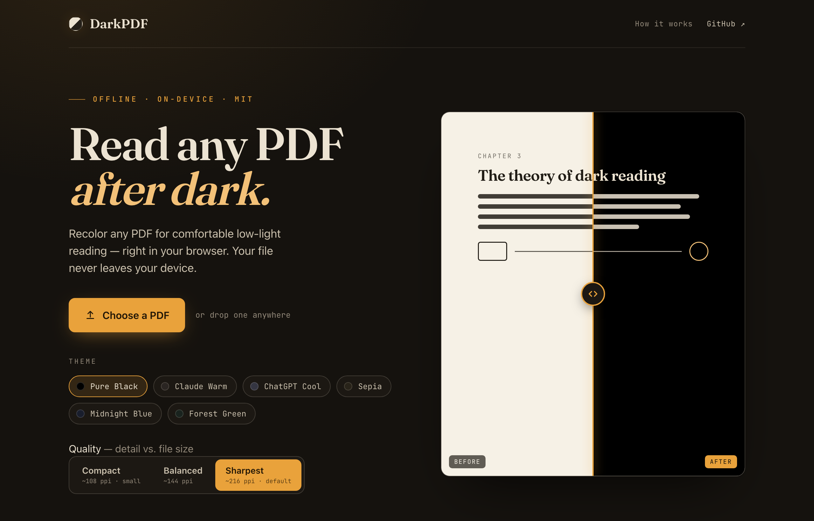

# DarkPDF — PDF Dark Mode Converter

Convert any PDF into a dark-mode version, **100% offline, right in your browser**. Your file
never leaves your device — no uploads, no servers, no internet required.

Most open-source PDF dark-mode tools either send your file to a server or need a command-line
toolchain (Python, Ghostscript, ImageMagick…) to run. DarkPDF does the entire job **locally in a
single HTML file** — open it and go.

Great for reading ebooks, papers, and textbooks at night without burning your eyes on a white page.

> 🔒 **Private by design.** All rendering happens locally via bundled copies of
> [pdf.js](https://mozilla.github.io/pdf.js/) and [pdf-lib](https://pdf-lib.js.org/). You can
> disconnect from the internet entirely and it still works.



## Features

- **Fully offline** — libraries are vendored in `vendor/`, nothing is fetched at runtime.
- **Multiple themes** — Pure Black (default), Claude Warm, ChatGPT Cool, Sepia, Midnight Blue, Forest Green.
- **Works on any PDF** — scanned, vector, or complex layouts (each page is recolored as an image).
- **Tuned for ebooks** — pages are embedded as JPEG to keep output files reasonably small.
- **Quality picker** — choose Compact / Balanced / Sharpest to trade detail against file size.
- **Live preview** — see the first 20 pages as they convert.
- **Drag & drop** or file picker.

## Usage

1. Open `index.html` in your browser (double-click works in **Safari** and **Firefox**).
2. Pick a theme (defaults to **Pure Black**).
3. Drag a PDF onto the page, or click **Choose PDF File**.
4. The converted PDF downloads automatically as `<name>_<theme>_dark.pdf`.

### Chrome note

Chrome blocks the local pdf.js *worker* when opening via `file://`. If you get a blank result,
serve the folder over a local HTTP server (still 100% local — nothing leaves your machine):

```bash
cd DarkPDF
python3 -m http.server 8000
# then open http://localhost:8000
```

## Configuration

The **Quality** control in the app sets the render resolution per conversion — pick
**Compact**, **Balanced**, or **Sharpest** depending on how a particular file comes out:

| Quality           | `RENDER_SCALE` | Approx. PPI | Full output\* | Best for |
| ----------------- | -------------- | ----------- | ------------- | -------- |
| Compact           | 1.5            | ~108        | ~53 MB        | Phones / tablets, lightest files |
| Balanced          | 2              | ~144        | ~81 MB        | Most reading |
| Sharpest (default)| 3              | ~216        | ~151 MB       | Maximum sharpness |

\* For a 482-page textbook (~11 MB source).

To change the defaults, edit two constants at the top of the `<script>` in `index.html`:

```js
const JPEG_QUALITY = 0.82;   // 0–1. Lower = smaller files.
let   RENDER_SCALE = 3;      // Default resolution; the Quality picker overrides it at runtime.
```

## How it works

Each PDF page is rasterized to a canvas at `RENDER_SCALE`×, then every pixel is remapped by
perceived brightness — white backgrounds become the theme's dark color, black text becomes white,
midtones interpolate between. The recolored pages are re-embedded as JPEGs into a new PDF.

Because the output is image-based, it works on **any** PDF, but the text is no longer selectable.

## Project structure

```
DarkPDF/
├── index.html              # The entire app (UI + conversion logic)
├── vendor/                 # Bundled dependencies for offline use
│   ├── pdf.min.js          # pdf.js          (Apache-2.0)
│   ├── pdf.worker.min.js   # pdf.js worker   (Apache-2.0)
│   ├── pdf-lib.min.js      # pdf-lib         (MIT)
│   └── fonts/              # Fraunces + JetBrains Mono (OFL) — even type is local
├── docs/                   # Screenshots / extra docs
├── README.md
├── LICENSE                 # MIT
├── THIRD_PARTY_LICENSES.md # Notices for bundled libraries
├── CONTRIBUTING.md
└── .gitignore
```

## Updating the bundled libraries

The vendored files are pinned for reproducibility. To refresh them:

```bash
curl -sSL -o vendor/pdf.min.js        https://cdnjs.cloudflare.com/ajax/libs/pdf.js/2.16.105/pdf.min.js
curl -sSL -o vendor/pdf.worker.min.js https://cdnjs.cloudflare.com/ajax/libs/pdf.js/2.16.105/pdf.worker.min.js
curl -sSL -o vendor/pdf-lib.min.js    https://cdnjs.cloudflare.com/ajax/libs/pdf-lib/1.11.0/pdf-lib.min.js
```

If you change versions, update `THIRD_PARTY_LICENSES.md` accordingly.

## Acknowledgements

This project is derived from
[Chizkiyahu/pdf-dark-mode-converter](https://github.com/Chizkiyahu/pdf-dark-mode-converter) (MIT).
It adds fully-offline vendored libraries, JPEG output for smaller files, and a pure-black default theme.

## License

[MIT](LICENSE) © Faizan Khan. Bundled third-party libraries retain their own licenses —
see [THIRD_PARTY_LICENSES.md](THIRD_PARTY_LICENSES.md).
